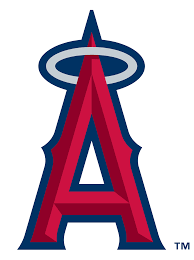

# first-API-project

This was created during my time as a student at Code Chrysalis.

This is my first solo project creating a fullstack API. I worked with data from the MLB Angels' 2019 season using Node.js, express, GraphQL, HTML, and CSS.

## Getting Started

This READ-ME file will help you install this project locally and explain how to interact with it.

## Prerequisites

You need: yarn, Node.js, postgres, knex, GraphQL

### Installing

- Fork and clone this repo to your computer
- Run yarn install
- Have fun!

### Running the tests

- use yarn test to run tests with this project

## Built With

Dropwizard - The web framework used

Maven - Dependency Management

ROME - Used to generate RSS Feeds

## Contributing

Please open a pull request if you would like to contribute to this project.

## Versioning

I use SemVer for versioning.

## Authors

Halee Pagel - Initial work - haleepagel
See also the list of contributors who participated in this project.

## License

This project is licensed under the MIT License - see the LICENSE.md file for details.

## Acknowledgments

Thank you to my wonderful instructors at Code Chrysalis for teaching me how to do all of this.

And, big thanks to my classmates for keeping me sane during the bootcamp process and answering all of my questions.

And finally, shoutout to github user @PurpleBooth for their amazing READ-ME template: <https://gist.github.com/PurpleBooth/109311bb0361f32d87a2>
